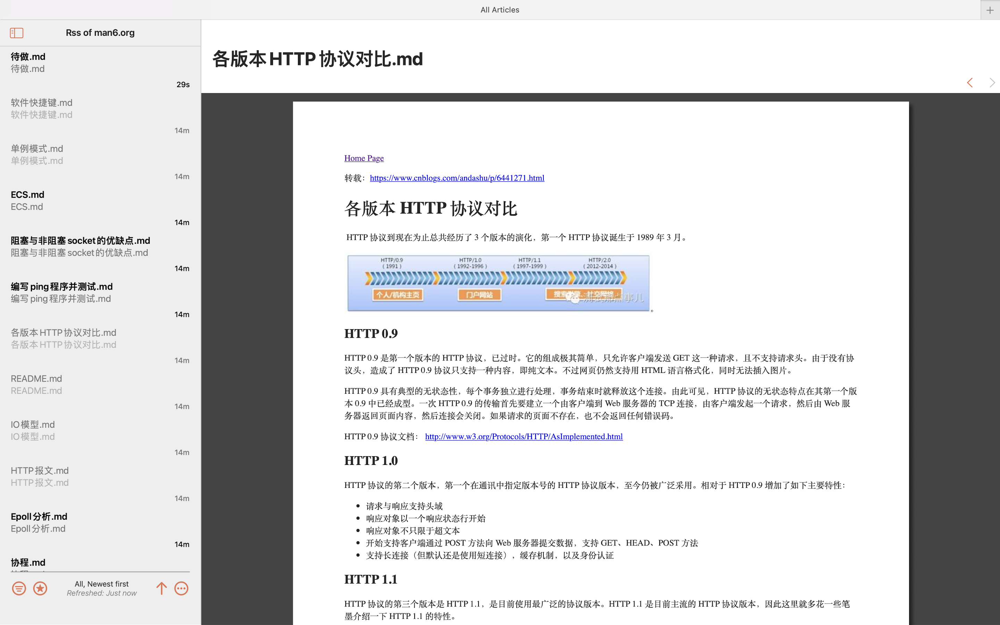

# mssws

mssws means **most simple static web server**.

A very simple and easy to use Static Web server. You can build your Blog
site in five minutes use this tool, without any edit to your Markdown files.

非常简单易用的静态 web 服务器，使用该工具，可以在 5 分钟内搭建出一个博客
站点, 不用对 markdown 文件做任何修改即可实现不错的渲染效果。

## Requirement|要求

* Go1.17 or later
* Python3

## Principle

Use texme library to render markdown files, use highlight.js to highlight
the code in markdown files, Use Golang to write esay Web server and turn
markdown to html which texme can parse.

## 原理

使用 texme 渲染 markdown，highlight.js 对代码进行高亮，Go 编写简单的 Web
服务器以及将 markdown 转换成 texme 能识别的 html 文档。

## Features

Vary simple to build blog site and render Markdown, Latex and PDF.

## 特点

可以十分简单的部署博客站点，并实现 Markown 和  LaTex 的渲染

## Usage

1. build a `blog` directory in `mssws` directory
2. copy your markdown or PDF files into `blog` directory
3. run script `run.sh`

If you want to see more info about how to run the program, run `./run.sh help`

##  使用

1. 在 `mssws` 目录下建一个目录 `blog`
2. 将 markdown 文件和 PDF 文件复制到 `blog` 目录下
3. 执行脚本 `run.sh`

如果想知道更多关于程序的信息，请执行命令 `./run.sh help`

## 示例|Example

[示例站点|Example site](http://www.man6.org/)

## Note

1. in `blog` directory, the files do not include spaces in the file name
2. in `blog` directory, markdown files only use `.md` suffix, PDF files only
use `.pdf` suffix
3. PDF fiels cannot use full text search

## 注意

1. `blog` 目录下的文件名不要包含空格
2. `blog` 目录下的 markdown 文件只允许使用 `.md` 后缀，PDF 文件只允许使用`.pdf` 后缀
3. PDF 文件无法进行全文检索

## 效果展示|Effect show

the index.html generated by genindex.sh

genindex.sh 生成的导航页

markdown render effect

markdown 文件渲染效果

full text search

全文检索功能

PDF preview

PDF 预览效果

RSS subscribe

RSS 订阅

## 使用的工具或者库 | Used tool or library

- texme
- PDF.js
- shellcheck

## changelog

2020/12/16

add full text search

增加了全文检索功能

2021/5/07

update texme version, now support markdown table grammar

升级 texme 版本，支持 markdowm table 语法

2021/05/27

use PDF.js, support PDF file preview

使用 pdf.js，增加了对 pdf 文件的在线预览支持

2021/05/29

add file suffix detect, only support `.md` or `.pdf` suffix, any not meet
standard file will print a warning when using `genindex.sh` to generate `index.html`

增加对文件后缀的检测，只支持标准的 `.md`, `.pdf` 后缀，对于不符合标准的文件会在
生成 index.html 的时候给出提示

2021/05/30

add directory monitor feature, if you open the feature, when the `blog` directory changed, will auto call `genindex.sh` then generate `index.html`

增加目录监控功能，如果开启该功能，可以在 `blog` 目录发生变化的时候自动执行 `genindex.sh` 脚本，更新 `index.html`

2021/06/01

rewrite `run.sh`, now you can control the program only `run.sh`, execute `./run.sh help` to get more information

重构了 `run.sh` 脚本，现在可以只通过这一个脚本管理整个程序，要查看更多信息的话请执行 `./run.sh help`

2021/08/22

add index page link, now you can easy to add some link in the index page. delete some useless files

添加了主页链接自定义配置功能，现在可以在主页上轻松的加上导航链接了。删除了一些无用的文件。

2021/12/05

add admin feature, you can visit /admin page to use some user-defined command, such as update blog

增加了 admin 功能，通过访问 /admin 页面可以执行一些自定义的命令,例如更新 blog 仓库

2022/05/03

add RSS support, now you can use RSS subscribe

增加 RSS 功能，现在可以支持 RSS 订阅了

2022/06/03

To achieve zero dependence on external resources, add all need JS, CSS resource into the project

为了实现对对外部资源的零依赖，将本项目需要的所有 JS CSS 资源都添加到了项目中

2023/03/05

fix shellcheck warning and wrong

修复 shellcheck 指出的警告和错误

2023/08/31

update libs, configuration, codes, remove code highlight

更新了依赖库，配置和代码, 删除了代码高亮

2023/09/06

remove admin page, add forbidden_files list

移除了 admin 页面, 增加了禁止访问页面列表

2023/12/10

use config.toml replace config.json
使用 config.toml 替代 config.json

2024/06/02

use log package to manager output
使用 log 库来管理输出输出

