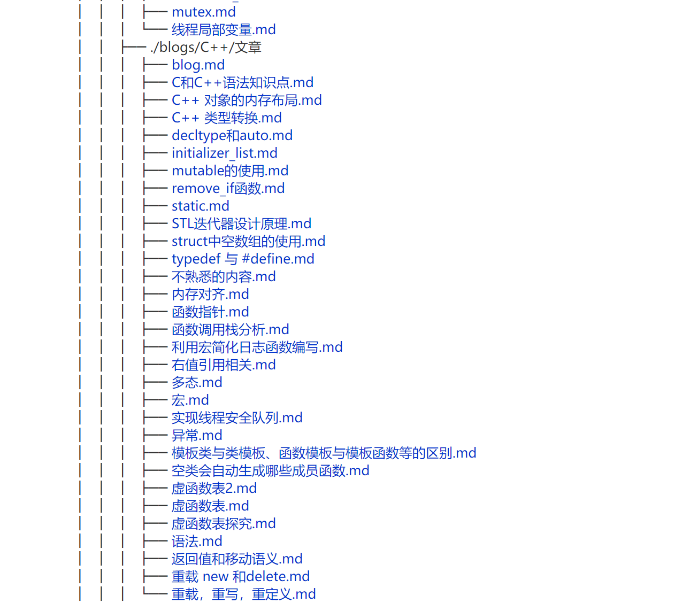
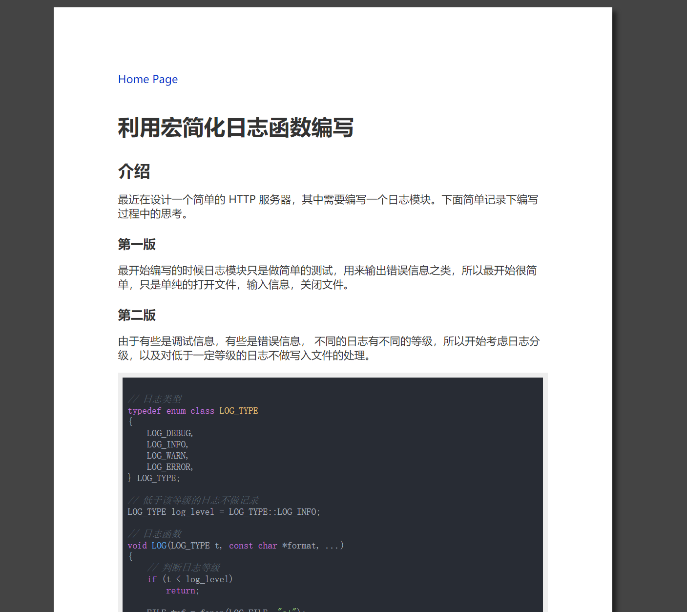
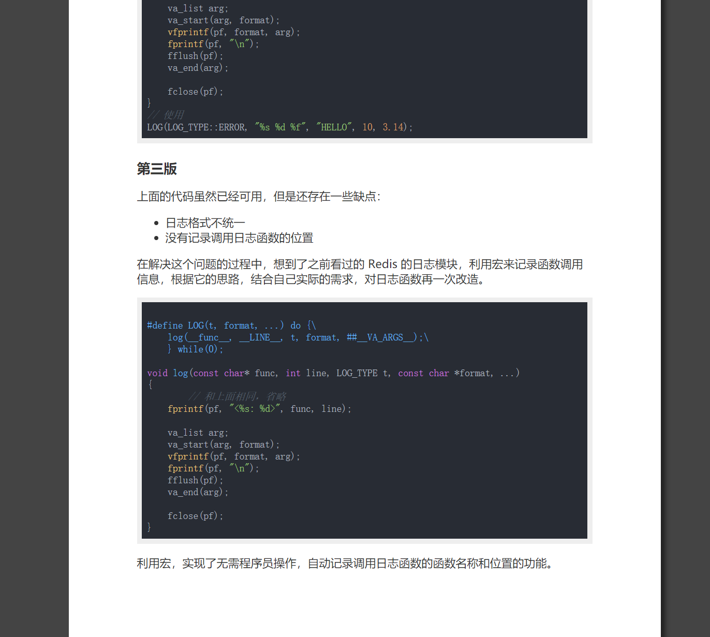
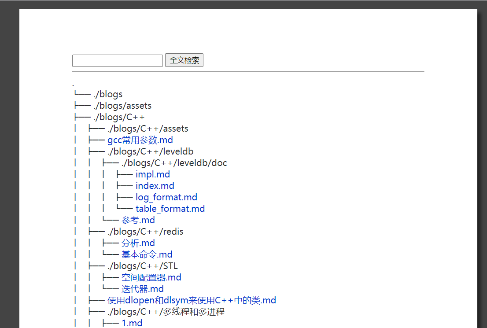
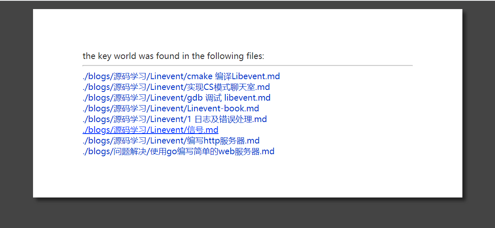

# mssws
most simple static web server

非常简单易用的静态 web 服务器，使用该工具，可以在 5 分钟内搭建出一个博客站点，不用对 Markdown 文件做任何修改即可实现不错的渲染效果


## 原理

使用 texme 渲染 markdown，highlight.js 对代码进行高亮，Go 编写简单的 Web 服务器以及将 markdown 转换成 texme 能识别的 html 文档


## 特点

可以十分简单的部署博客站点，并实现 Markown 和  LaTex 的渲染


##  使用

1. 将 markdown 文件放到 `main.go` 目录下，执行 `bash genindex.sh`
2.  执行 `go build main.go && ./main`, 如果要以后台程序执行，那么编译后执行 `bash run.sh`


## 项目结构

``` bash

├── LICENSE
├── README.md
├── article_tempplate.html  # 文章展示模板 
├── config.json         # 配置文件
├── doc.html            # 可以不用管
├── genindex.py         # 生成 indx.html, 被genindex.sh调用
├── genindex.sh         # 更新index.html的脚本，每次修改修改博客目录后执行一遍   
├── image
├── main.go             # 主要代码，负责将markdowm文件转换为html文件，运行服务器 
├── pull_and_update.sh  # 可以不用管
├── query_template.html # 查询结果展示模板
└── run.sh
```


## 示例

[示例站点](http://www.bearcarl.top/)


## 注意

1. markdown 文件名不要包含空格


## 效果展示

genindex.sh 生成的导航页


genindex.sh 生成的导航页





md  文件渲染效果



md  文件渲染效果



全文检索功能



全文检索效果



## 使用的工具或者库

- texme
- highlight.js


## changelog

2020/12/16
增加了全文检索功能

2021/5/07
升级 texme 版本，支持 markdowm table 语法了
