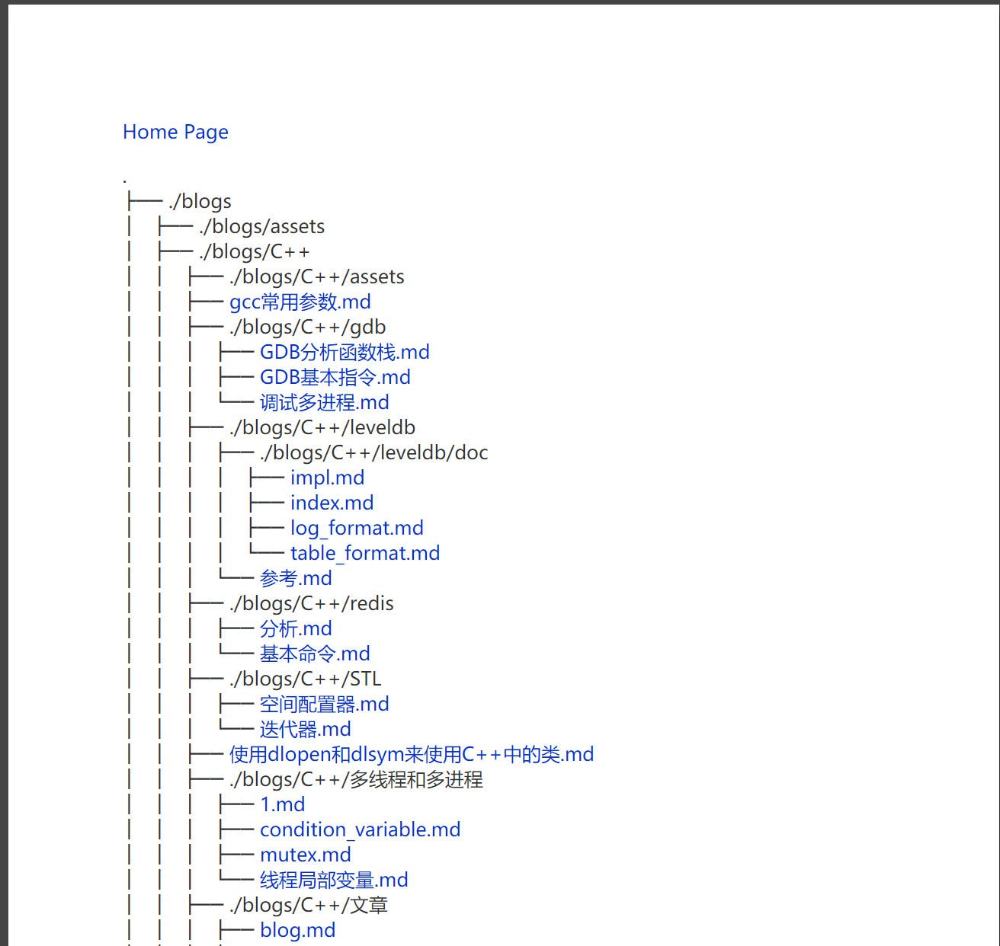

# mssws

mssws means **most simple static web server**.

A very simple and easy to use Static Web server. You can build your Blog
site in five minutes use this tool, without any edit to your Markdown files.

非常简单易用的静态 web 服务器，使用该工具，可以在 5 分钟内搭建出一个博客
站点, 不用对 markdown 文件做任何修改即可实现不错的渲染效果。


## Principle

Use texme library to render markdown files, use highlight.js to highlight
the code in markdown files, Use Golang to write esay Web server and turn
markdown to html which texme can parse.


## 原理

使用 texme 渲染 markdown，highlight.js 对代码进行高亮，Go 编写简单的 Web
服务器以及将 markdown 转换成 texme 能识别的 html 文档。


## Features

Vary simple to build blog site and render Markdown, Latex and PDF.


## 特点

可以十分简单的部署博客站点，并实现 Markown 和  LaTex 的渲染


## Usage

1. build a `blog` directory in `mssws` directory
2. copy your markdown or PDF files into `blog` directory
3. run script `run.sh`

If you want to see more info about how to run the program, run `./run.sh help`

##  使用

1. 在 `mssws` 目录下建一个目录 `blog`
2. 将 markdown 文件和 PDF 文件复制到 `blog` 目录下
3. 执行脚本 `run.sh`

如果想知道更多关于程序的信息，请执行命令 `./run.sh help`


## 项目结构|Project structure

``` bash

├── LICENSE
├── README.md
├── article_template.html
├── blog   # default blog directory
├── config.json
├── directory_monitor.sh
├── genindex.py  # generate index.data, called by genindex.sh
├── genindex.sh  # update index.data, will auto run if you use default config
├── image
├── index.data   # save your blog directory's `tree` command output
├── index_template.html
├── main.go      # main logic
├── pdfjs-2.7.570-dist  # pdfjs lib
├── query.data   # save all files which suppport full text search
├── query_template.html
└── run.sh       # run the server and more operations 

```

## config

``` json
{
    "SiteTitle" : "www.bearcarl.top",
    "HomePageLink" : "/index.html",
    "HomePageTitle" : "Home Page",
    "FootPrint" : "",
    "TexmeCDNLink" : "https://cdn.jsdelivr.net/npm/texme@1.0.0",
    "HighlightCDNLink" : "https://cdn.bootcss.com/highlight.js/9.12.0/highlight.min.js",
    "HighlightThemeCDNLink" : "https://cdn.bootcss.com/highlight.js/9.12.0/styles/atom-one-dark.min.css",
    // don't change the BlogDir, this version change the BlogDir will cause a bug
	"BlogDir" : "./blog",
    "IP" : "0.0.0.0",
    "Port" : "80",
    "OpenDirMonitor" : "true",
    "MonitorScript" : "directory_monitor.sh",
    "MonitorRefreshTick" : 10,

    // the first line of index page, you can save some other website's link
    "SiteLinks" : [
	{
	    "Title": "文档",
	    "Url" : "http://www.bearcarl.top/doc.html"
	},
	{
	    "Title" : "Github",
	    "Url" : "https://github.com/LiuYinCarl/mssws/"
	}
    ]
}

```

## 配置

``` json
{
    "SiteTitle" : "www.bearcarl.top",
    "HomePageLink" : "/index.html",
    "HomePageTitle" : "Home Page",
    // 页面最下面一行 可以用来放置备案号等信息
    "FootPrint" : "",
    "TexmeCDNLink" : "https://cdn.jsdelivr.net/npm/texme@1.0.0",
    "HighlightCDNLink" : "https://cdn.bootcss.com/highlight.js/9.12.0/highlight.min.js",
    "HighlightThemeCDNLink" : "https://cdn.bootcss.com/highlight.js/9.12.0/styles/atom-one-dark.min.css",
    // 请不要修改 BlogDir 配置，该版本尚不支持，强行修改会产生bug
	"BlogDir" : "./blog",
    "IP" : "0.0.0.0",
    "Port" : "80",
    // 是否开启文件夹监控，在博客文件夹更新后可以迅速更新主页
    "OpenDirMonitor" : "true",
    // 文件夹监控脚本
    "MonitorScript" : "directory_monitor.sh",
    // 文件夹监控间隔时间
    "MonitorRefreshTick" : 10,
    // 主页的最上面一行，用来放置链接
    "SiteLinks" : [
	{
	    "Title": "文档",
	    "Url" : "http://www.bearcarl.top/doc.html"
	},
	{
	    "Title" : "Github",
	    "Url" : "https://github.com/LiuYinCarl/mssws/"
	}
    ]
}

```

## 示例|Example

[示例站点|Example site](http://www.man6.org/)


## Note

1. in `blog` directory, the files do not include spaces in the file name
2. in `blog` directory, markdown files only use `.md` suffix, PDF files only
use `.pdf` suffix
3. PDF fiels cannot use full text search

## 注意

1. `blog` 目录下的文件名不要包含空格
2. `blog` 目录下的 markdown 文件只允许使用 `.md` 后缀，PDF 文件只允许使用`.pdf` 后缀
3. PDF 文件无法进行全文检索


## 效果展示|Effect show

the index.html generated by genindex.sh

genindex.sh 生成的导航页




markdown render effect

markdown 文件渲染效果


full text search

全文检索功能


PDF preview

PDF 预览效果


## 使用的工具或者库 | Used tool or library

- texme
- highlight.js
- PDF.js


## changelog

2020/12/16

add full text search

增加了全文检索功能


2021/5/07

update texme version, now support markdown table grammar

升级 texme 版本，支持 markdowm table 语法


2021/05/27

use PDF.js, support PDF file preview

使用 pdf.js，增加了对 pdf 文件的在线预览支持


2021/05/29

add file suffix detect, only support `.md` or `.pdf` suffix, any not meet
standard file will print a warning when using `genindex.sh` to generate `index.html`

增加对文件后缀的检测，只支持标准的 `.md`, `.pdf` 后缀，对于不符合标准的文件会在
生成 index.html 的时候给出提示


2021/05/30

add directory monitor feature, if you open the feature, when the `blog` directory changed, will auto call `genindex.sh` then generate `index.html`

增加目录监控功能，如果开启该功能，可以在 `blog` 目录发生变化的时候自动执行 `genindex.sh` 脚本，更新 `index.html`


2021/06/01

rewrite `run.sh`, now you can control the program only `run.sh`, execute `./run.sh help` to get more information

重构了 `run.sh` 脚本，现在可以只通过这一个脚本管理整个程序，要查看更多信息的话请执行 `./run.sh help`

2021/08/22

add index page link, now you can easy to add some link in the index page. delete some useless files
添加了主页链接自定义配置功能，现在可以在主页上轻松的加上导航链接了。删除了一些无用的文件。
